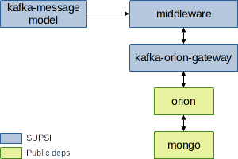

# [BF] Kafka-Orion-Gateway

This repository describes how to use the Docker image for the *kafka-orion-gateway* component, as part of the Cognitive Human Robot Interaction (C-HRI) scenario defined within the Better Factory project. The deployment is provided by means of Docker Compose, and the set of initialized components is depicted in the picture here below:



The blue-colored components represent the core components for which SUPSI provides and maintains a Docker image, while the green-colored ones represent dependencies that are provided as Docker images by third parties.

### kafka-orion-gateway
The *kafka-orion-gateway* component serves as a data gateway between two brokers, i.e., Kafka Broker (KB) and Orion Context Broker by FIWARE (OCB).

A specific service subscribes a set of predefined topics in KB, then converts the information to an OCB entity and forwards the message to OCB using the OCB REST API endpoint.

At the same time, a REST controller is defined to receive notifications from OCB. All the notifications are converted into an Avro-serializable object and forwarded to dedicated KB topics.

### Dependencies

#### middleware

The image is based on the [fast-data-dev (v2.6.2)](https://github.com/lensesio/fast-data-dev/tree/fdd/2.6.2) project by Lenses.io and runs a full fledged Kafka installation (including extra services, e.g., UIs).

In addition, the Schema Registry is automatically populated with schemas available under the `/schemas` directory. In our deployment, the `/schemas` directory is read from the *kafka-message-model* component.

The middleware is run in secure mode and can be accessed at [localhost:3040](localhost:3040) (credentials are stored in the docker-compose file).

#### kafka-message-model
This component embeds the data model shared within the Better Factory project. The data model is automatically uploaded to the Schema Registry available within the *middleware*.


#### orion
The *orion* component runs an instance of the Orion Context Broker (v3.1.0). It requires a MongoDB instance to use as storage system, which is provided by the *mongo* component.

#### mongo
The *mongo* component runs an official MongoDB docker image (v4.4).


## How to Use

### Requirements

All the components are provided as Dockerized applications, thus the following software is required:

- Docker
- Docker Compose

We tested our deployment on a machine running Ubuntu 21.04, with Docker v20.10.8, and Docker Compose v1.29.2.

### Install

Before running the containers, it is required to download the Docker images from their respective registries.
While some images are publicly available, some other require credentials to be downloaded from private registries.

> NOTE: Images provided by SUPSI can be download from the GitLab container registry, which supports the token-based authentication. Please send your request for a new token to the repository maintainers.

Once you are provided with a username and a token, you can issue the following command to login to the private GitLab Docker registry and download the images:

```shell
docker login registry.example.com -u <username> -p <token>
docker-compose pull
```

### Usage
The docker-compose file automatically runs all the components as Docker containers. Each container can be customized by editing its environment parameters. The current deployment already set the right values for all the parameters.
We suggest the user to only modify variables listed in the `.env` file, if needed.

| Parameter name             | Parameter value | Default |
| -------------------------- | --------------- | ------  |
| BF_USER | A username shared by all the components | **bfuser** |
| BF_PASSWORD | A password shared by all the components | **bfpwd123** |

Run the **up** command to start all the containers:

```shell
docker-compose up -d
```

You can now access different components:

- Kafka is accessible from the Kafka Development Environment, which is available at [localhost:3040](http://localhost:3040/). Here you can check schemas uploaded to the Schema Registry, as well as existing Kafka topics and their content.

- Orion is available at [localhost:1026](http://localhost:1026/) and can be queried using its [API](https://fiware-orion.readthedocs.io/en/1.13.0/user/walkthrough_apiv2/index.html). For example, the following query retrieves all the entities stored to the current Orion instance:

```shell
curl localhost:1026/v2/entities -s -S -H 'Accept: application/json' | python -mjson.tool
```

## Maintainers

- Vincenzo Cutrona - vincenzo.cutrona@supsi.ch
- Niko Bonomi - niko.bonomi@supsi.ch
- Giuseppe Landolfi - giuseppe.landolfi@supsi.ch
